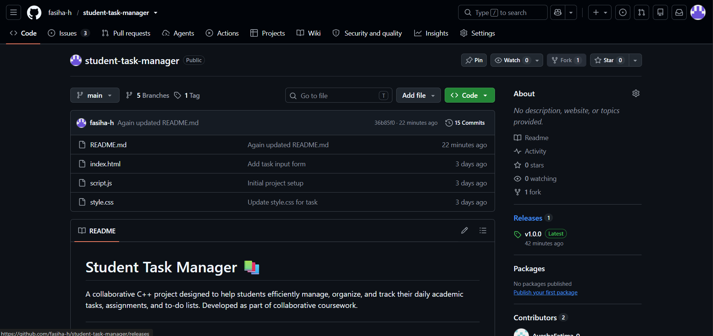
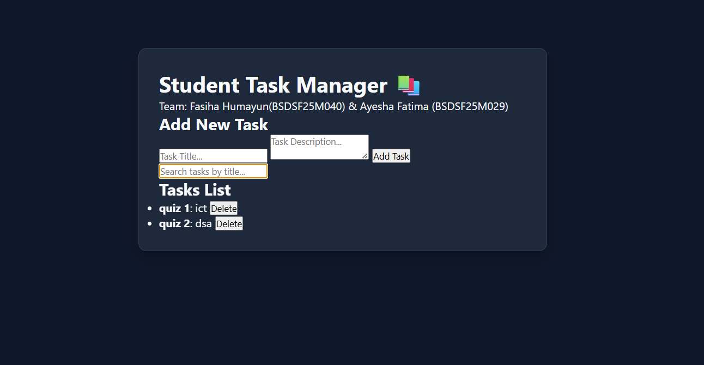

# Student Task Manager 📚

## 📝 Project Description

The Student Task Manager is a collaborative C++ software project designed to help students efficiently manage, organize, and track their daily academic tasks, assignments, and to-do lists. The main objective of this project is to provide students with practical experience in robust task management alongside version control and team collaboration.

## 👥 Team Members

- **Fasiha Humayum** (Roll No: BSDSF25M040)
- **Ayesha Fatima** (Roll No: BSDSF25M029)

## ✨ Core Features

- **Task Management:** Seamlessly add, view, update, and delete academic tasks.
- **Search Functionality:** Quickly search and filter through existing tasks by title or keyword.
- **Data Persistence:** Save and load tasks directly from file storage to prevent data loss.
- **Browser History Integration:** Navigate through task management history using custom stack data structures.

## 🛠️ Technologies & Tools Used

- **Programming Language:** C++
- **Version Control System:** Git & GitHub
- **Development Environment:** Visual Studio Code & Command Prompt (CMD)

## 🔀 Git Workflow & Branching Strategy

This project follows a collaborative pair-based branching strategy utilizing feature branches, pull requests, and merge conflict resolution.

- **Active Branches:**
  - `main`
  - `branch-fasiha`
  - `feature/task-form`
  - `feature/task-search`

## ⚙️ Git Commands Demonstrated

The following Git commands were practiced and demonstrated during the project lifecycle:

- Initialization & Cloning: `git init`, `git clone`
- Tracking & Committing: `git status`, `git add`, `git commit`
- Branching & Merging: `git branch`, `git switch`, `git merge`
- History & Remote: `git log --oneline --graph --all`, `git remote -v`, `git push`, `git pull`
- Version Tagging: `git tag`, `git push --tags`

## 🌐 GitHub Features Demonstrated

- **Issue Tracking:** Creating issues and linking them with pull requests (e.g., Issue #6).
- **Pull Requests & Code Reviews:** Collaborative code integration and review processes between team members.
- **Branch Protection & Merging:** Maintaining main branch integrity and clean merge history.
- **Releases:** Publishing official GitHub releases for stable project versions (`v1.0.0`).

## 🚀 How to Run the Project

1. Clone the repository to your local system:
   ```bash
   git clone [https://github.com/fasiha-h/student-task-manager.git](https://github.com/fasiha-h/student-task-manager.git)
   ```




